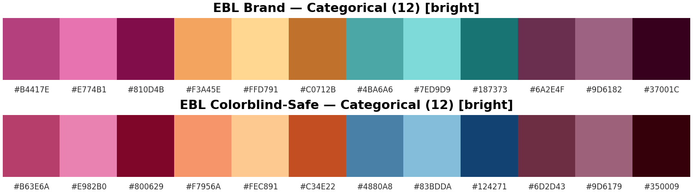

# Economic Brain Lab — Palettes & Styles

Brand-aligned **categorical palettes**, a **colorblind-safe variant**, and **Matplotlib style sheets** (bright & dark) for the Economic Brain Lab.

<p align="center">
  
</p>

## Contents

- `styles/ebl.mplstyle` — Bright theme (Ivory Mist background)
- `styles/ebl_dark.mplstyle` — Dark theme (Charcoal Ink background)
- `ebl_palette.py` — Palettes + helpers (register colormaps, set cycles)
- `examples/demo.py` — Script to generate showcase figures
- `figures/` — Generated example figures (bright & dark)

## Quick start

```bash
python -m venv .venv && source .venv/bin/activate  # Windows: .venv\Scripts\activate
pip install -r requirements.txt
python examples/demo.py
```

### Use in your code

```python
import matplotlib.pyplot as plt
from ebl_palette import EBL_PALETTE, EBL_SAFE_PALETTE, use_ebl_palette, register_colormaps

# Bright style
plt.style.use('styles/ebl.mplstyle')
use_ebl_palette(safe=False)  # brand

# Or dark style
# plt.style.use('styles/ebl_dark.mplstyle')
# use_ebl_palette(safe=True)  # colorblind-safe

# Example plot
import numpy as np
x = np.linspace(0, 2*np.pi, 200)
for i, c in enumerate(EBL_PALETTE):
    plt.plot(x, np.sin(x + i*0.2), color=c, label=f"G12")
plt.legend(ncol=4, frameon=False)
plt.tight_layout(); plt.show()
```

## Palettes

**Brand (12):** `#B4417E, #E774B1, #810D4B, #F3A45E, #FFD791, #C0712B, #4BA6A6, #7ED9D9, #187373, #6A2E4F, #9D6182, #37001C`

**Colorblind-safe (12):** `#B63E6A, #E982B0, #800629, #F7956A, #FEC891, #C34E22, #4880A8, #83BDDA, #124271, #6D2D43, #9D6179, #350009`

## Styles

- **Bright**: Ivory Mist background, Charcoal Ink text, subtle warm grid.
- **Dark**: Charcoal Ink background, Ivory Mist text, slightly stronger grid.
- Both prefer **Montserrat** (titles) and **Lato** (labels) with fallbacks.

> Ensure fonts are installed system-wide for consistent rendering. On Linux/macOS, refresh font cache: `fc-cache -f -v`.

## Showcase

- Categorical bars (brand vs. safe): `figures/demo_categorical_bars_bright.png`, `figures/demo_categorical_bars_dark.png`
- Lines (12 series, brand): `figures/demo_lines_brand_bright.png`, `figures/demo_lines_brand_dark.png`
- Scatter (safe + markers): `figures/demo_scatter_safe_bright.png`, `figures/demo_scatter_safe_dark.png`
- Heatmaps (sequential & diverging): `figures/demo_heatmaps_bright.png`, `figures/demo_heatmaps_dark.png`
- Swatches (brand & safe): `figures/demo_swatches_bright.png`, `figures/demo_swatches_dark.png`

## License

[MIT](LICENSE)

## Maintainer

Economic Brain Lab — Dragan Rangelov

## Changelog

- 2025-11-14 — Initial release (v0.1.0)
